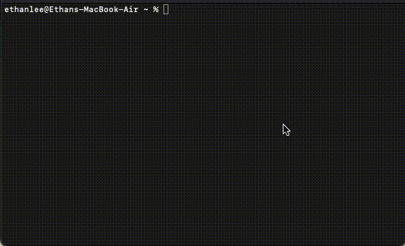

# Session Share

<br>

## Description

Session Share is an app to create vote-driven dynamic spotify queues that can be accessed by anyone with an invite. 

A ‘host’ can link their spotify account with our app to create a new session. The host can then send an invite to their sessions and invitees are added to the session as ‘jammers’. Once connected, jammers can request for songs through the hosts’ spotify account. Each song in the queue will have a ‘like’ and ‘dislike’ button associated with it that the jammers can tap. Songs in the queue will be xdynamically reordered based on the number of likes they receive or removed from the queue entirely based on the number of dislikes they get.

## App Evaluation

Category: Social/Music.

Mobile: This app would be primarily developed for mobile but would perhaps be just as viable on a computer.

Story: Lets users make music queues that anyone with an invite can join. Users in the party can not only add songs of their choice to the queue, but also like/dislike the songs in the queue. Songs in the queue are reorded based on their likes.

Market: Any individual could choose to use this app.

Habit: This app could be used as frequently as the user wanted depending on how often they socialise.

Scope: First this would be used by individuals hosting a party, then this could perhaps be used by restaurants and bars and other such commercial enterprises. Spotify or Apple Music could even integrate this as a feature on their service.

# Product Spec

## 1. User Stories (Required and Optional)

### Required Must-have Stories

* User can login

* User can create a new session as host

* Jammers can join an existing session 

* Jammers can add songs to the queue

* Jammers can like songs present in the queue

* Jammers can dislikes songs present in the queue

* Songs in the queue are reordered based on the number of likes they get

### Optional Nice-to-have Stories

* Host can send invites

* Hosts can stay logged in

* Songs in the queue are removed based on the number of dislikes they get

## 2. Screen Archetypes

* Login Screen

   * Host can login

   * Jammers can join an existing session

* Session Screen

   * Jammers can like songs present in the queue

   * Jammers can dislikes songs present in the queue

   * Songs in the queue are reordered based on the number of likes they get

* Song Request Screen

   * Jammers can add songs to the queue


## 3. Navigation


### Tab Navigation (Tab to Screen)

* Login Screen

* Session Screen

* Song Request Screen

### Flow Navigation (Screen to Screen)

* Login Screen -> Links Spotify account and creates a new Session Screen

* Login Screen -> connect to an existing Session Screen

* Session Screen -> Song Request Screen (to pick the song to add)


# Wireframes


# Schemas

###  Models

 Model: Room

| Property | Type | Description |
| --------|--------|--------|
| Host | String | Name of the host |
| Jammers | Array of Strings | Names of Jammers|
| Auth Key | String | Token to be used with the Spotify API|
| Room Code | String | Unique string that identifies the room|
| Songs | Array of our custom data type| List of songs in the queue|
| Current Song | String | Current song that is being played |
| Current Song Progress| Time | Track song progress |
| Duration | Time | Time since session began |
| isPlaying | Boolean | Toggles play/pause |


Model: Song

| Property | Type | Description |
| --------|--------|--------|
| Song ID | String | Song identifier to give to Spotify |
| Song Name | String | Name of the song |
| Song Artist | String | Artist of the song |
| Album Art | Image | Album art of the song |
| Likes Count | Number | Number of likes for a song |
| Dislikes Count | Number | Number of dislikes for a song |

###  Networking 

* Login/Join Screen
    * (Create/POST) Join the room
        ```
        room = findRooms(input) 
        if (room is null)
            Print message
        else
            SegueToNextStoryboard()
        ```
    * (Create/POST) Link Spotify account and create room
        ```
        token = signInToSpotify()
        if (token is not valid)
            Print message
        else
            SegueToNextStoryboard()
        ```
* Session Screen

    * (Create/POST) Create a Like/Dislike for a given song in the queue
        ```
        if action is like 
            setSongLikes(room, song_input, like)
        else
            setSongLikes(room, song_input, dislike)
        ```
    *  (Read/GET) Get the (songs in the) queue
        ```
            return getSongs(room)
        ```
* Song Request Screen

    * (Create/POST) Request to add a given song to the queue
        ```
        song = Spotify.findSong(input)
        addSong(room, Song)
        ```
    * (Read/GET) Search for a songs and get the results
        ```
        return Spotify.getSongs(input)
        ```

